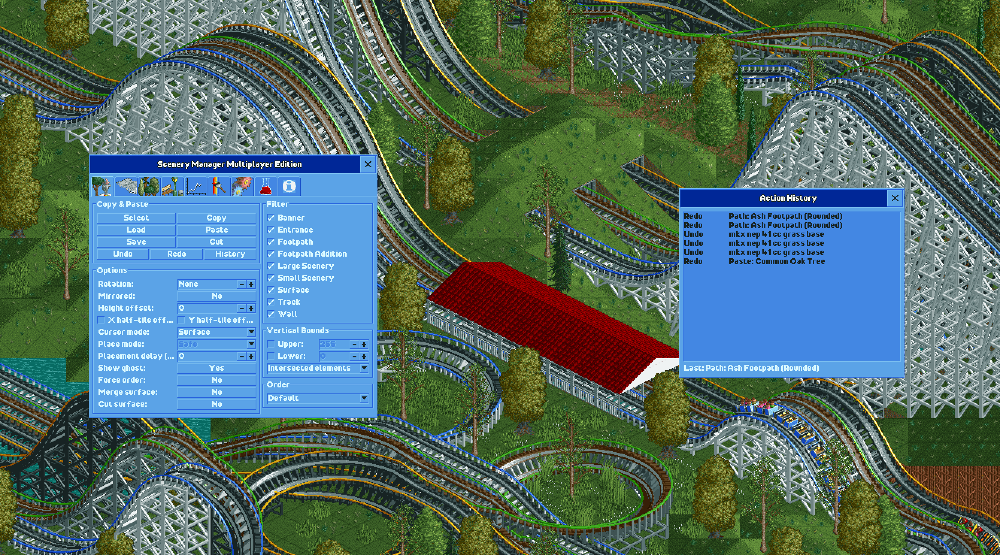

# OpenRCT2 Scenery Manager Multiplayer Edition

A multiplayer-compatible fork of the Scenery Manager plugin for OpenRCT2. Designed for use on multiplayer servers, with full support for importing templates created with the original Scenery Manager plugin.

## Multiplayer Edition Features

- Multiplayer support with server-safe item placement and removal
- Custom placement delay when pasting to stay within server rate limits
- Placement order patterns (Default, Radial, Spiral, Random) for visual animations
- Action history window with full undo/redo support (now features pausing/resuming/cancelling actions)
- X/Y half-tile offset when pasting quarter-tile objects
- Loading of objects from saved templates
- Import saved templates from the original Scenery Manager plugin
- Fixed colors on picked items in the find and replace tool
- No Duplicates filter: skips fully overlapped duplicate objects in a set when copying or pasting
- Skip Existing: skips over existimg items on the map that would be cause duplicates when pasting
- Progress meter/status when pasting/undoing/redoing
- Undo/redo supports native scenery, paths, and bulldozer tools. Just press ctrl+z or ctrl+shift+z to undo or redo even when the plugin window is not open.

## Installation

1. Make sure that your OpenRCT2 version is up-to-date. You need at least version `0.4.28`.
2. Download the latest `openrct2-scenery-manager-multiplayer-edition-*.js` file from the releases page.
3. Save it in the `plugin` subfolder of your OpenRCT2 user directory.\
On Windows, this is usually at `C:\Users\{User}\Documents\OpenRCT2\plugin`.\
If you had a previous version of the Scenery Manager installed, make sure to delete its file from the `plugin` folder.
4. Start OpenRCT2 and open a scenario. If this is the first time that you use this plug-in, it should show a welcome message.

## Usage

### User Interface

The preferred way to work with this plug-in is to use hotkeys. Nevertheless, everything can also be done via the Scenery Manager window.

To open the graphical user interface, click on "Scenery Manager Multiplayer Edition" in the map menu in the upper toolbar of OpenRCT2, or simply press the `[W]` key.

If you want to change any hotkey, go to the 'Controls and Interface' tab of OpenRCT2's 'Options' window.

### Copy and Paste

- **Select Area** `[CTRL + A]`: Activates the selection tool. You can now select an area of the map with click and drag (click the left mouse button and hold it down, move the cursor, release the button).\
If you want to edit an existing selection, press `[CTRL + SHIFT + A]` to enter a multi-selection mode.

- **Copy Area** `[CTRL + C]`: Copies the selected region to the clipboard and switches to paste mode.

- **Paste Area** `[CTRL + V]`: Activates the paste mode. If you now hover the cursor over the map, a ghost of the scenery template will be shown. Click anywhere to place the template at the shown location.

- **Cut Area** `[CTRL + X]`: Copies and then removes the selected area.

- **Load Template** `[SHIFT + L]`: Opens a dialog where you can load a saved template from the template library to the clipboard.

- **Save Template** `[SHIFT + S]`: Opens a dialog where you can permanently save the current template from the clipboard to the template library.

Note that any tool in OpenRCT2 can be cancelled by pressing the `[ESC]` key.

#### Paste Options

Basic options:

- **Rotate Template** `[Z]`: Rotates the template.

- **Mirror Template** `[CTRL + M]`: Mirrors the template. Only works in paste mode.

- **Height offset**: By default, templates are pasted at the surface's height. This option adds a vertical offset to the template. Press `[J]` to decrease, `[K]` to reset and `[L]` to increase the offset.

Options shared with other tools:

- **Cursor mode**: See **[Settings](#Settings)**.

- **Place mode**: See **[Settings](#Settings)**.

- **Placement order**: Controls the visual order in which elements are placed tile-by-tile. Combined with the placement delay, this determines how the scenery animates onto the map as it is being placed. See **[Placement Order](#Placement-Order)** below.

- **X/Y half tile offset**: Offsets all small scenery elements in the selection by half a tile unit in the X and/or Y direction. Useful for placing small scenery between grid positions.

- **Show ghost**: See **[Settings](#Settings)**.

- **Undo** `[CTRL + Z]`: Undoes the most recent paste or cut operation. Only placement actions are tracked; up to 20 recent operations can be undone.

Advanced options, mostly relevant for **Raw** place mode:

- **Force order**: Preserves the exact order of all elements on a tile when they were copied. It inserts the elements at the end of the source tile, rather than merging them into existing elements with respect to their height. This is useful only when the order of the elements were changed in the Tile Inspector.

- **Merge surface**: Allows multiple surface elements on a single tile instead of replacing the existing element.

- **Cut surface**: By default, the 'cut' operation copies surfaces, but does not remove them, which is the desired behaviour in the most cases, especially when working in safe mode. If this option is enabled, the 'cut' operation will also remove surfaces (if the corresponding filter is also enabled).

#### Placement Order

The placement order controls the sequence in which tiles are placed when pasting a template. When combined with the **Placement delay** setting, each mode creates a distinct visual animation effect as the scenery appears on the map.

- **Default**: Places tiles in the same order they were copied — left-to-right, top-to-bottom. Predictable and consistent.

- **Radial**: Places tiles outward from the center of the selection, creating a ripple or bloom effect that radiates from the middle of the template.

- **Spiral**: Places tiles in an outward clockwise spiral from the center, similar to Radial but following a tighter, continuous path.

- **Random**: Places tiles in a randomised order, creating a scattered or "dissolve-in" appearance as the template fills in unpredictably.

> **Tip:** Set the placement delay to `50`–`200` ms to make the animation visible. Higher delays create a slower, more dramatic reveal. This is also useful on multiplayer servers to avoid hitting action rate limits.

#### Filter

Check or uncheck any of the checkboxes in the filter section of the window. It will affect both copy and paste actions.\
You can also use the `[CTRL + 1]` through `[CTRL + 9]` hotkeys to toggle one filter respectively, or `[CTRL + 0]` to toggle all filters at once.

- **No duplicates**: When enabled, fully overlapped duplicate objects — multiple objects of the same type at the exact same position, height, and rotation — are reduced to a single instance. Applies to both copy and paste. Useful for cleaning up areas that were built with clearance checks disabled. Non-rotatable objects such as trees and bushes are treated as duplicates regardless of their stored rotation value.

#### Vertical Bounds

Enable upper and lower bounds to restrict the paste operation to a vertical subsection. Choose **Intersected elements** to paste all elements that intersect the given bounds. Choose **Contained elements** to paste all elements that are completely contained in the given bounds.

### Action History

The Action History window/tab tracks every paste and cut operation and allows you to undo or redo them individually. Open it by clicking the **History** button in the Copy/Paste tab.

The list displays all recorded actions newest-first, each showing whether it can be undone or redone, a description of the action, and a repeat count for batched operations. Click any entry to undo or redo it. The window updates live as actions are performed.

- **Undo** `[CTRL + Z]`: Undoes the most recent applied action.
- **Redo** `[CTRL + Y]`: Reapplies the most recently undone action.

Up to 50 recent operations are tracked per session. 

### Clipboard

Any copied or loaded template gets added to the clipboard. You can cycle through the entries of the clipboard with the `[Q]` (previous template) and `[E]` (next template) keys. You can delete the current template with the `[CTRL + D]` hotkey.

The clipboard will not be persistent across sessions. If you want to keep your copied templates, save them to the library!

### Library

The library consists of an editable structure of folders and files (i.e. scenery templates), just like any other file system. Here you can store all your creations in a well-ordered manner.

Templates are saved in a compressed format using property name shorthand and default value stripping, which reduces template file sizes by approximately 67% compared to the original format (e.g. a 1.5 MB template saves as ~0.5 MB). Older uncompressed templates are still supported and will load correctly.

Double-click any template to load it. Alternatively you can use the buttons in the first tab or the hotkeys:

- **Load Template** `[SHIFT + L]`: Opens a window to select and load a template. The template is then added to the clipboard.

- **Save Template** `[SHIFT + S]`: Opens a window to save the clipboard's current template to a new file or override an existing one.

### Scatter Tool

The scatter tool is a brush that randomly places scenery from a previously selected palette. You can choose up to five different small scenery objects or large scenery objects and choose a density for each of them. Click on the **Pick** button to select an object from the map.

#### Scatter Tool Options

- **Randomise rotation**: Picks a random rotation for each pasted scenery item.

- **Randomise quadrant**: Picks a random quadrant for each pasted quarter tile small scenery item.

- **Height offset**: Pastes the scenery at the given height offset above the surface.

Similar to scenery templates, scatter patterns can also be saved and loaded.

### Bench Brush

The bench brush works similar to the scatter tool. It can place footpath additions, such as benches, litter bins, lamps or queue TVs, in a predefined pattern onto existing footpaths.

Choose a pattern size and up to that many footpath additions. The brush will place them in the specified pattern onto existing footpaths.

### Object Index

The object index contains every loaded scenery object and footpath object in the current scenario. You can refresh the index with the **Refresh index** button, though this is only really necessary if you changed the loaded objects during the game, which does not happen in normal scenario play.

Furthermore, the **Scan map** and **Scan area** buttons scan the map or a specified area, respectively, and count the number of instances of each loaded object. It also keeps track of the number of those instances that are within the park borders. This process may take a long time, especially on larger maps!

At the top, you can filter the list for type, usage and name or identifier.

#### Object Details

Clicking on any object in the object index will open another window that displays this object's information. Additionally, you can cycle though the object's instances with the **Jump** button, or go to the Replace tab (see **[Element Replacing](#Element-Replacing)** below) by clicking one of the **Go to: ...** buttons.

### Element Replacing

You can search for tile elements of a certain type and with certain properties and also replace them by something else (of the same type).

#### Searching

In the first part of the tab, you can specify the type and the properties that you want to search for. Here, **< Any >** means that the elements will not be filtered for this property.

If you play on a CSO (Custom Scenery Object) map, then you can choose to filter footpaths by *either* the legacy object *or* the surface and railings objects. The other property / properties will then be set to **< None >**.

- **Jump to next instance**: Cycles through all instances on the map that fit the specified properties.

- **Search and Delete**: Searches all instances on the map that fit the specified properties and *deletes* them. There is no undo function, so be careful!

#### Replacing

In the second part of the tab, you can specify properties that should be replaced. The type of the replacing element must always match the type of the replaced object.

Again, if you play on a CSO map, footpaths are a little bit tricky. If you want to replace a legacy object, you have to either specify another legacy object, or *both* a surface object *and* a railings object.

- **Swap...**: Swaps all property values of the 'Replace with' section with the property values of the 'Search for' section.

- **Search and Replace**: Searches all instances on the map that fit the specified properties of the 'Search for' section and *replaces* them with the specified values of the 'Replace with' section. There is no undo function, so be careful!

#### Search Options

- **Selected area only**: Restricts the search to the area that was selected on the map.

- **Select area**: Starts the selection tool to select an area.

- **In park only**: Restricts the search to the area within the park borders.

- **Place mode**: See **[Settings](#Settings)**.

## Settings

These settings are persistent through sessions.

### All Tools

- **Cursor mode**: This setting specifies which tile a tool has clicked on or is hovering over. In **Surface** mode, the tile is determined by the surface element that the cursor points to. So it ignores any scenery, track or entities that may lie between the cursor and the surface. In **Scenery** mode, the tile is determined by the element directly under the cursor, let it be scenery, track or surface.

- **Place mode**: Specifies which internal mechanisms are used to place and remove elements on the map.

  - **Safe**: This mode is safe for regular scenario play and also for multiplayer. It applies collision detection (which can be turned off by cheats) and other validations. This mode does *not* support pasting terrain and may paste queue layouts incorrectly. (Internally, it uses GameActions.)

  - **Raw**: This mode supports copying of queue layouts, terrain, track segments and much more. However, it does not do any validations (e.g. collision detection). (Internally, it uses raw data access.) **Note:** Raw mode is automatically disabled and locked to Safe when playing on a multiplayer server.

- **Placement delay (ms)**: Adds a delay in milliseconds between each placement or removal action. Many OpenRCT2 multiplayer servers enforce a rate limit on game actions, which can cause placements to fail or be dropped when pasting large templates. Setting an appropriate delay (e.g. `50`–`200` ms) makes Scenery Manager compatible with these servers by spacing out actions to stay within the limit. It also creates a visual animation effect when combined with a placement order. Set to `0` to disable.

- **Show ghost preview**: Disabling this increases performance with huge templates or brushes.

- **Behaviour if element unavailable**: This only applies to loaded templates and scatter patterns, or if you are changing the loaded objects while a scenario is running. In these cases, it can happen that you want to place an element that is unavailable in the current scenario.

### Paste Tool

- **Disable height hotkeys**: Disables the height hotkeys (`[J]`, `[K]`, `[L]`) while the paste tool is inactive.

- **Small step size**: Most elements can only be placed at heights that are a multiple of 2 units. Enabling this setting allows to place everything at any height.

- **Height offset with mouse cursor**: Allows to click and drag the mouse up and down to paste a template at a different height.

- **Rotation with mouse cursor**: Allows to click and drag the mouse left and right to paste a template at a different rotation.

  - **Flip rotation direction**: Swaps clockwise and counterclockwise rotation.

  - **Sensitivity**: Adjusts the sensitivity of the rotation.

### Area Selection Tool

- **Keep selection**: If enabled, it keeps the area selection when the tool is finished. Otherwise, the area selection will be reset.

- **Options window**: If enabled, all relevant options will be shown in a small window while the area selection tool is active.

### Brush Tool

- **Size**: The diameter or side length of the brush.

- **Shape**: The shape of the brush, either **Circle** or **Square**.

- **Drag to place**: If enabled, you can hold down the mouse button and drag the cursor across the map to apply the brush along the path of the cursor.

- **Options window**: If enabled, all relevant options will be shown in a small window while the brush tool is active.

## Known Problems

- [safe mode] Copy / paste does not work well on sloped surfaces.
- [safe mode] Banner text and colour do not copy.
- [safe mode] Queue layouts do not copy correctly.
- Scroll position resets when list content changes.
- Large scenery does not mirror.
- Trackitecture does not work cross-map.

## Special Thanks

A huge thank you to **Sadret**, the original creator of Scenery Manager, without whom this plugin would not exist. If you'd like to support his work, you can [buy him a coffee](https://ko-fi.com/sadret).

## Support Me

If you find any bugs or have ideas for improvements, you can open an issue on GitHub.

If you like this plug-in, please leave a star on GitHub.

## Copyright and License

Copyright (c) 2020-2026 Sadret\
Copyright (c) 2026 RYJASM\
The OpenRCT2 plug-in "Scenery Manager Multiplayer Edition" is licensed under the GNU General Public License version 3.
